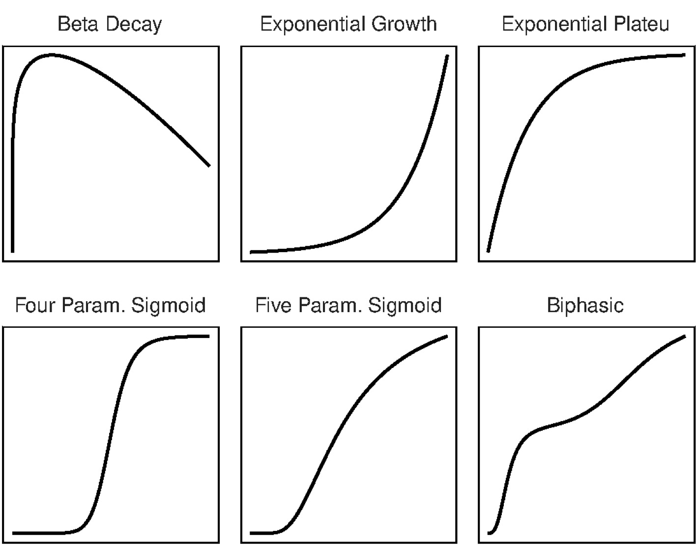

# dosefitr

**dosefitr** is an R package for analysing longitudinal biological data, with a focus on growth dynamics and dose-response relationships. It provides a flexible and automated framework for non-linear regression, enabling robust and interpretable modelling of time-resolved experiments.

Originally developed for high-content live-cell imaging data, dosefitr is **platform-agnostic** and can be applied to any longitudinal dataset where growth, decay, or response trajectories are measured over time.

## **Key Features**

- **Flexible non-linear regression**
  - Built-in support for common models (sigmoidal, exponential, biphasic, etc.).
  - Easy extension to custom user-defined models.
  - Automatic model selection using BIC.
- **Longitudinal analysis**
  - Designed for time-resolved datasets rather than endpoint-only measurements.
  - Supports extraction of growth rates and doubling times.
- **Dose-response modelling**
  - Calculation of growth rate inhibition (GR), normalised drug response (NDR), and longitudinal growth-response score (LGR) metrics.
  - Improved comparability across models with different baseline growth rates.
- **Robust fitting**
  - Outlier detection (ROUT + robust regression).
  - Parameter constraints and shared parameters across groups.
- **Scalable workflows**
  - Works with tabular data from any source.
  - Compatible with high-throughput and batch-processing pipelines.

**Installation**

You can install dosefitr via:

```{r}
remotes::install_github("moorezac/dosefitr")
```

**Usage**

The principle goal of dosefitr is to provide a user-friendly pipeline to segment, analyse, and visualise image-based longitudinal drug response data.

### 1. Image Processing

Raw time-lapse images are processed using the bundled Python scripts, which can be
called directly from R:

```r
# Step 1a: Segment cells in each frame using Cellpose
run_cellpose()

# Step 1b: Merge segmentation masks with source imagery
run_combine()

# Step 1c: Track cells across frames using TrackMate
run_trackmate()
```

### 2. Curve Fitting

Tracking outputs are imported into R for dose–response modelling. The package supports GR, NDR, and LGR metrics with robust regression and BIC-based model selection:

```r
# For a single curve
result <- fit_curve(
  data,
  x_var,
  y_var,
  curve_opts = NA,
  shared_opts = NA,
  outlier_opts = NA
)

# Across concentrations
model_list <- interpolate_curve_concentration(
  data,
  x_var,
  y_var,
  treatment_column,
  concentration_column,
  negative_control_name,
  ...
)
```

However, the automated curve fitting functions are able to be used on any dataset, and includes option for shared parameters across groups, outlier detection, and upper/lower limits on parameters. See below for built-in options:

<div align="center">
  
</div>

### 3. Visualisations

Fitted curves and summary metrics can be plotted using the built-in plotting functions:

```r
# Plot fitted values
plot_curve_concentration(
  model_list,
  x_var,
  y_var,
  treatment_column,
  concentration_column,
  negative_control_name,
  ...
)

# Plot metric over time at each concentration
plot_curve_concentration_metric_time(
  model_list,
  x_var,
  y_var,
  treatment_column,
  concentration_column,
  negative_control_name,
  ...
)

# Plot dose-response curve over concentration
plot_curve_concentration_metric_dose(
  model_list,
  x_var,
  y_var,
  treatment_column,
  concentration_column,
  negative_control_name,
  ...
)
```

## Learn

See the vignettes:

[Example run](vignettes/example_run.Rmd)


[Exporting IncuCyte data](vignettes/export_data.Rmd)

[Running the segmentation pipeline](vignettes/python_preprocess.Rmd)
